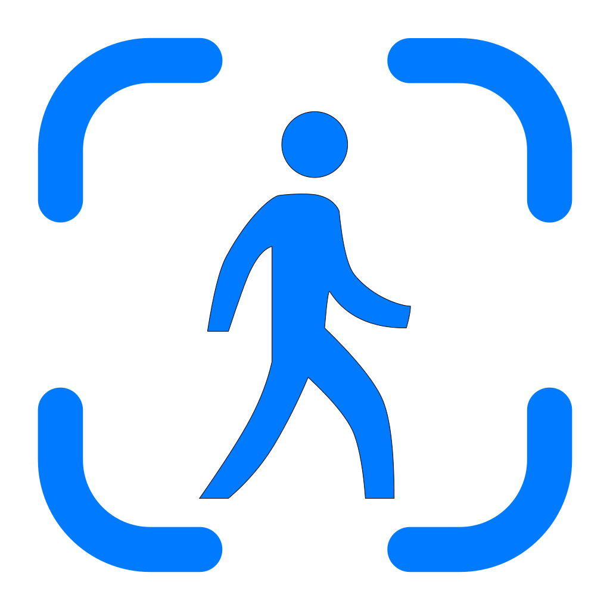
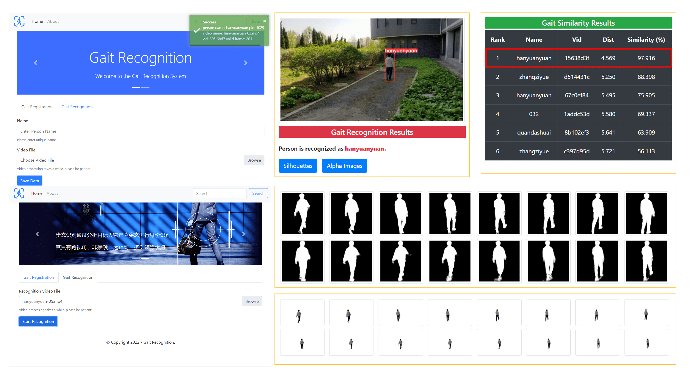

# <div align="center" style="display: flex; align-items: center; justify-content: center;">&nbsp;Gait Recognition System</div>

<div align="center">Human Gait Recognition and Comparison System Based on Deep Learning</div>

<div align="center"></div>

---

## Requirements

```sh
pip install -r requirements.txt
```
Please download the [latest release model](https://github.com/jackhanyuan/GaitRecognitionSystem/releases/latest), and unzip the compressed file to `model/gait/output`.

## Run
```shell
python main.py
```
Web access: `http://localhost:5000/`

**Notes:** 

- Please complete the gait registration first and ensure that the video in the database is greater than 0. Then you can start gait recognition!

- Please make sure there is only one person in the video. The version of multi-person will be updated later.

## Acknowledgement

- [GaitPretreatment](https://github.com/jackhanyuan/GaitPretreatment)
- [RobustVideoMatting](https://github.com/PeterL1n/RobustVideoMatting)
- [classification-pytorch](https://github.com/bubbliiiing/classification-pytorch)
- [YOLOv5](https://github.com/ultralytics/yolov5)
- [OpenGait](https://github.com/ShiqiYu/OpenGait)
- [GaitRecognition](https://github.com/hongyonghan/GaitRecognition)

## Citation

```
@mastersthesis{韩园园2023基于深度学习的步态识别与比较系统,
  title={基于深度学习的步态识别与比较系统},
  author={韩园园},
  year={2023},
  school={大连理工大学}
}

@inproceedings{han2022gaitpretreatment,
  title={GaitPretreatment: Robust Pretreatment Strategy for Gait Recognition},
  author={Han, Yuanyuan and Wang, Zhong and Han, Xin and Fan, Xiaoya},
  booktitle={2022 International Conference on Communications, Computing, Cybersecurity, and Informatics (CCCI)},
  pages={1-6},
  year={2022},
  organization={IEEE}
}
```

**Note:**
Gait Recognition and Comparison System is only used for **personal academic purposes**, people cannot use this code for anything that might be considered commercial use.